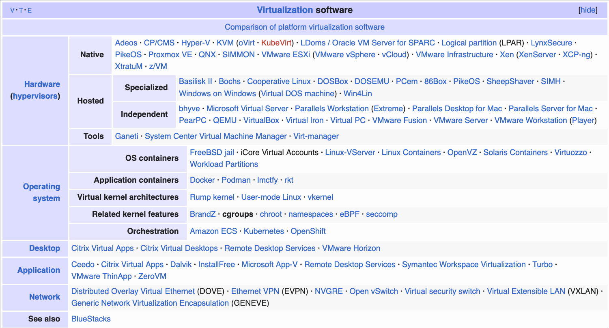
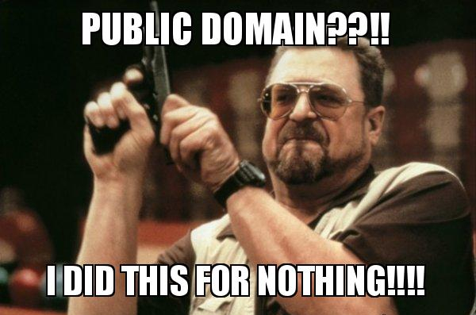

# Deploy like it’s the 1980s
verMan.io

# Open-source cross-platform multicloud deploys with|without Docker

Simplifying—and futureproofing—software deployments.

# Complexities 0/3

<iframe class="slide-deck"
        height="100%"
        width="100%"
        style="min-height: 400px"
        src="https://landscape.cncf.io"></iframe>

# Complexities 1/3

<iframe class="slide-deck"
        height="100%"
        width="100%"
        style="min-height: 400px"
        src="https://en.wikipedia.org/wiki/Google_Cloud_Platform#Products"></iframe>
<!-- security.mixed_content.block_active_content -->

# Complexities 2/3

<table>
<colgroup>
<col style="width: 100%" />
</colgroup>
<thead>
<tr>
<th>Certification</th>
</tr>
</thead>
<tbody>
<tr>
<td>AWS Certified DevOps Engineer - Professional</td>
</tr>
<tr>
<td>Cisco Certified Network Associate (CCNA) Cloud</td>
</tr>
<tr>
<td>Cloud Security Alliance: Certificate of Cloud Security Knowledge
(CCSK)</td>
</tr>
<tr>
<td>CompTIA Cloud+</td>
</tr>
<tr>
<td>Dell Technologies Cloud Architect Certification</td>
</tr>
<tr>
<td>Google Professional Cloud Architect</td>
</tr>
<tr>
<td>Huawei Certified ICT Expert - Cloud Computing</td>
</tr>
<tr>
<td>ISC2 Certified Cloud Security Professional (CCSP)</td>
</tr>
<tr>
<td>Microsoft Certified: Azure Solutions Architect Expert</td>
</tr>
<tr>
<td>Oracle Cloud Infrastructure Architect Associate</td>
</tr>
<tr>
<td>Red Hat Certified Specialist in Cloud Infrastructure</td>
</tr>
<tr>
<td>VMware Certified Professional - Cloud Management &amp;
Automation</td>
</tr>
<tr>
<td>Alibaba Cloud Certified Professional - Cloud Computing</td>
</tr>
</tbody>
</table>

# Complexities 3/3

-   System administrator
-   Network administrator

-   DevOps engineer

-   CI/CD
-   MLOps engineer
-   GitOps

-   Site reliability engineer (SRE)

-   Platform engineer
-   Internal Development Platform (IDP) engineer

-   Internal developer tool engineer
-   PaaS

# <https://github.com/SamuelMarks>

Samuel Marks.

-   Research fellow at Harvard Medical School / MEEI  
-   PhD from the University of Sydney  
-   800+ GitHub repos  
-   300+ of these sources not forks  
-   top 10 contributor to Keras  
-   Google Developer Expert for Machine Learning / Artificial
    Intelligence  
-   13+ years of software-engineering consulting experience

# Architecture

<h2>
Single node
</h2>

<figure class=''>

</figure>

<h2>
3 nodes \[3n\] (p2p)
</h2>

<figure class=''>

</figure>

<h2>
3n (master / slave)
</h2>

<figure class=''>

</figure>

<h2>
5n (cluster)
</h2>

<figure class=''>

</figure>

# Deployment approaches

<h2>
Adhoc
</h2>

-   Always the most fun!

<h2>
Image creation
</h2>

-   Docker, OCI
-   VirtualBox, VMware, Hyper-V
-   AWS, Google Cloud, Azure
-   Other (WASM, unikernels)

<h2>
Configuration management
</h2>

-   Ansible
-   Puppet
-   Chef
-   Salt

<h2>
Orchestrator (of images, containers, and/or jobs)
</h2>

-   Slurm
-   Mesos
-   Kubernetes

# Cross-platform

## Cross-platform

-   Docker

<iframe width="560" height="315" src="https://www.youtube.com/embed/DvMh4_ak6r4?si=kXR-owualRUrPEU1" title="YouTube video player" frameborder="0" allow="accelerometer; autoplay; clipboard-write; encrypted-media; gyroscope; picture-in-picture; web-share" referrerpolicy="strict-origin-when-cross-origin" allowfullscreen></iframe>

## More than cross-platform

1.  Docker (Linux)  
2.  Linux (native)  
3.  macOS  
4.  Windows  
5.  iOS  
6.  Android  

1.  FreeBSD, OpenBSD, NetBSD  
2.  HP/UX  
3.  SunOS, Open Solaris, illumos  
4.  z/OS  
5.  DOS  
6.  OS/360  

## More than Docker

<figure>

<figcaption aria-hidden="true"><a
href="https://en.wikipedia.org/wiki/Comparison_of_platform_virtualization_software">https://en.wikipedia.org/wiki/Comparison_of_platform_virtualization_software</a></figcaption>
</figure>

## Multicloud

## More than multicloud

1.  Amazon Web Services (AWS)  
2.  Microsoft Azure  
3.  Google Cloud  
4.  IBM Cloud  
5.  Alibaba Cloud Elastic Compute Service (ECS)  
6.  Aurora Compute  
7.  Microsoft Azure (ARM)  
8.  cloudscale.ch  
9.  CloudSigma  
10. Apache CloudStack  

1.  DigitalOcean  
2.  Dimension Data (NTT Ltd.)  
3.  Exoscale  
4.  Gandi.net  
5.  gridscale  
6.  Ikoula  
7.  Internet Solutions  
8.  Kamatera  
9.  libvirt  
10. Maxihost  
11. Nimbus  
12. NTT America  

1.  NTT Communications Cloud Infrastructure Services  
2.  OnApp  
3.  OpenStack  
4.  Outscale  
5.  Outscale Inc.  
6.  Outscale SAS  
7.  OVHcloud  
8.  Rackspace  
9.  Scaleway  
10. UpCloud  
11. VMware vCloud  
12. Vultr  

## 37signals (honourable mention)

<iframe class="slide-deck"
        height="100%"
        width="100%"
        style="min-height: 400px"
        src="https://www.theregister.com/2025/05/09/37signals_cloud_repatriation_storage_savings/
"></iframe>

## More than open-source

**License:** public domain

## Website

<https://verMan.io>

## Unique Value Proposition

<ul class="incremental tui-window">
<li>
1-click deploy
</li>
<li>
2-click multicloud deploy
</li>
<li>
Cross-platform
</li>
<li>
Documentation generation
</li>
<li>
Cloud / host agnostic
</li>
</ul>

## Website (embedded)

<iframe class="slide-deck"
        height="100%"
        width="100%"
        style="min-height: 400px"
        src="https://verMan.io"></iframe>

## Revenue opportunities

<ul class="incremental">
<li>
create a new lift-and-shift software-engineering consultancy (to/fro
mainframes and clouds)
</li>
<li>
selling to companies building atop kubernetes (to alternatively build
atop agnostic tech);
</li>
<li>
enter the as-a-Service market, or provide whitelabel
as-a-Service-as-a-Service:
<ul>
<li>
databases
</li>
<li>
MLOps
</li>
<li>
cpanel alternative
</li>
<li>
full PaaS… or similar.
</li>
</ul>
</li>
</ul>

## Conclusion

## Roadmap

  

    

      
Now

      Working version
    

  

  

    

      
+1 week

      Telemetry (OpenTelemetry linked throughout; with multiple dashboarding and metric-gathering systems)
    

  

  

    

      
+2 weeks

      Backups; more docs; more toolchains
    

  

  

    

      
+3 weeks

      PaaS type functionality; GitOps
    

  

  

    

      
+4 weeks

      More databases, toolchains, servers on more OSs and distributions
    

  

## Questions?

Thank you for viewing & attending this presentation!

-   <samuel@offscale.io>  
-   <https://github.com/SamuelMarks/libscript>  
-   <https://github.com/verman-io>
